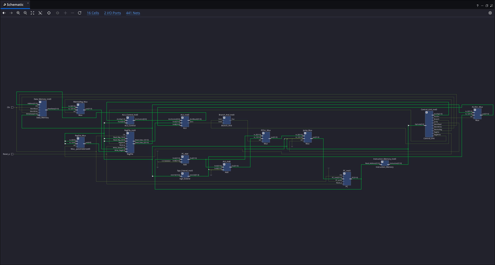

<!-- Improved compatibility of back to top link: See: https://github.com/othneildrew/Best-README-Template/pull/73 -->
<a id="readme-top"></a>


<!-- PROJECT LOGO -->
<br />
<div align="center">
  <a href="https://github.com/kenwang92/mips_cpu">
    
  </a>

<h3 align="center">Single-Cycle MIPS processor with in verilog HDL</h3>

  <p align="center">
    手搓MIPS單週期處理器
    <br />
    <a href="https://github.com/kenwang92/mips_cpu/issues/new?labels=bug&template=bug-report---.md">Report Bug</a>
    &middot;
    <a href="https://github.com/kenwang92/mips_cpu/issues/new?labels=enhancement&template=feature-request---.md">Request Feature</a>
  </p>
</div>

<!-- ABOUT THE PROJECT -->
## About The Project

此項目使用純verilog實現mips單週期cpu，目前已實現指令如下

| Instruction | ALUControl | TYPE |
| :---------- | :--------: | ---: |
| ADD         |   `0010`   |    R |
| SUB         |   `0110`   |    R |
| AND         |   `0000`   |    R |
| OR          |   `0001`   |    R |
| SLT         |   `0111`   |    R |
| NOR         |   `1100`   |    R |
| LW          |   `0010`   |    I |
| SW          |   `0010`   |    I |
| BEQ         |   `0110`   |    I |
| J           |   `0000`   |    J |


<!-- GETTING STARTED -->

<details>
  <summary>Table of Contents</summary>
  <ol>
    <li><a href="#usage">Usage</a></li>
    <li><a href="#Top">Top Level (top.v)</a></li>
    <li><a href="#Program_Counter">Program Counter(PC.v)</a></li>
    <li><a href="#Instruction_Memory">Instruction_Memory (Instruction_Memory.v)</a></li>
    <li><a href="#RegFile">RegFile (RegFile.v)</a></li>
    <li><a href="#Sign_Extend">Sign_Extend (Sign_Extend.v)</a></li>
    <li><a href="#Control_Unit">Control_Unit (Control_Unit.v)</a></li>
    <li><a href="#ALU">ALU (ALU.v)</a></li>
    <li><a href="#ALU_Control">ALU_Control (ALU_Control.v)</a></li>
    <li><a href="#Data_Memory">Data_Memory (Data_Memory.v)</a></li>
    <li><a href="#Mux">Mux (Mux.v)</a></li>
    <li><a href="#Add">Add (Add.v)</a></li>
    <li><a href="#Branch_And">Branch_And (Branch_And.v)</a></li>
    <li><a href="#contributing">Contributing</a></li>
    <li><a href="#license">License</a></li>
    <li><a href="#contact">Contact</a></li>
    <li><a href="#acknowledgments">Acknowledgments</a></li>
  </ol>
</details>

## Prerequisite Knowledge（仙貝知識）
計算機組織、數位邏輯、verilog語法

## Usage
將verilog輸入輸出模板複製到檔案中，並依照設計目標實現模塊功能，可參考<a href="#acknowledgments">學習資源</a>

## Top
Top 模塊是整個 MIPS 單週期處理器的頂層整合單元。它的主要職責是實例化（Instantiate）所有子模塊（如 PC、ALU、Control Unit、Memories 等），並定義它們之間的資料路徑（Datapath）與控制訊號連線。此模塊不處理具體運算，而是負責將「取指、解碼、執行、訪存、寫回」這五個階段的訊號串接起來，包括處理 Branch 與 Jump 的路徑選擇邏輯，確保資料能在正確的時脈週期內流動並完成指令執行。

```verilog
module top (
        Clk,
        Reset_p
    );
    input Clk;
    input Reset_p;
endmodule

```
<p align="right">(<a href="#readme-top">back to top</a>)</p>

## Program_Counter
PC（Program Counter）模塊負責維護當前執行的指令位址。它是一個帶有非同步重置（Reset）功能的暫存器。在 Reset_p 訊號觸發時會歸零；在一般運作的時脈上升緣，若 PC_write enable，則會更新為輸入的 PC_next 值。它是推動整個 CPU 依序執行指令的動力來源。

```verilog
// Program Counter
module PC (
        Clk,
        Reset_p,
        PC_next,
        PC_write,
        PC
    );
    input Clk;
    input Reset_p;
    input [31:0]PC_next;
    input PC_write;

    output reg [31:0]PC;
endmodule
```
<p align="right">(<a href="#readme-top">back to top</a>)</p>

## Instruction_Memory
Instruction Memory 模塊模擬了唯讀記憶體（ROM），用於儲存程式碼。它在模擬開始時會從 instr_mem.txt 檔案載入機械碼。其運作方式為「非同步讀取」，接收來自 PC 的 32 位元位址輸入後，忽略最低 2 位元（Word Alignment），直接輸出對應位址的 32 位元指令資料，供後續解碼階段使用。

```verilog
module Instruction_Memory (
        Read_Address,
        Instruction
    );
    input [31:0]Read_Address;
    output [31:0]Instruction;
endmodule

```
<p align="right">(<a href="#readme-top">back to top</a>)</p>

## RegFile
RegFile 模塊實現了 MIPS 架構下的 32 個通用暫存器（Register File）。它支援「雙讀單寫」架構：擁有兩個非同步讀取埠，能同時輸出 rs 與 rt 的數值；以及一個同步寫入埠，在時脈上升緣（Positive Edge）且 RegWrite 訊號致能時將資料寫入指定暫存器。此外，模塊內建了硬體保護邏輯，確保 0 號暫存器（$zero）永遠保持為 0，無法被寫入修改。

```verilog
module RegFile (
        Clk,
        Reset_p,
        RegWrite,
        Read_Reg_1,
        Read_Reg_2,
        Write_Reg,
        Write_Data,
        Read_Data_1,
        Read_Data_2
    );
    input Clk;
    input Reset_p;
    input RegWrite;
    input [4:0]Read_Reg_1; // rs
    input [4:0]Read_Reg_2; // rt
    input [4:0]Write_Reg;  // rd
    input [31:0]Write_Data;

    output [31:0]Read_Data_1;
    output [31:0]Read_Data_2;
endmodule

```
<p align="right">(<a href="#readme-top">back to top</a>)</p>

## Sign_Extend
Sign_Extend 模塊負責處理立即數（Immediate）的符號擴展。在執行 I-type 指令（如 addi, lw, beq）時，它將指令中的 16 位元立即數擴展為 32 位元，以符合 ALU 的輸入格式。其運作邏輯是複製 16 位元輸入的最高位（Sign Bit）填滿高 16 位元，確保數值在擴展後保持正負號不變。

```verilog
module Sign_Extend (
        imm16,
        imm32
    );
    input [15:0]imm16;
    output [31:0]imm32;
endmodule

```
<p align="right">(<a href="#readme-top">back to top</a>)</p>

## Control_Unit
Control Unit 是處理器的決策中心，負責指令解碼。它接收指令的 OpCode（高 6 位元），並透過組合邏輯產生所有對應的控制訊號（如 RegDst, ALUOp, MemRead, Branch, Jump 等）。這些訊號指揮資料路徑中的多工器切換方向、記憶體的讀寫權限以及 ALU 的運算類型，確保處理器能正確區分並執行 R-type, lw, sw, beq, j 等不同指令。
```verilog
module Control_Unit (
        OpCode,
        RegDst,
        Jump,
        Branch,
        MemRead,
        MemtoReg,
        ALUOp,
        MemWrite,
        ALUSrc,
        RegWrite
    );
    input [5:0]OpCode;
    output reg RegDst;
    output reg Jump;
    output reg Branch;
    output reg MemRead;
    output reg MemtoReg;
    output reg [1:0]ALUOp;
    output reg MemWrite;
    output reg ALUSrc;
    output reg RegWrite;
endmodule

```
<p align="right">(<a href="#readme-top">back to top</a>)</p>

## ALU
ALU（算術邏輯單元）是處理器的運算核心。它根據輸入的 4 位元 ALUControl 訊號，對兩個 32 位元運算元（SrcA, SrcB）執行加法、減法、邏輯 AND/OR/NOR 或小於比較（SLT）等運算。運算結果透過 ALUResult 輸出，同時會產生一個 Zero 旗標訊號（當結果為 0 時置 1），該旗標專門用於分支指令（beq）的條件判斷。
```verilog
module ALU (
        SrcA,
        SrcB,
        ALUControl,
        ALUResult,
        Zero
    );
    input [31:0]SrcA;
    input [31:0]SrcB;
    input [3:0]ALUControl;
    output reg [31:0]ALUResult;
    output Zero;
endmodule

```
<p align="right">(<a href="#readme-top">back to top</a>)</p>

## ALU_Control
ALU_Control 模塊是一個二級解碼器，用於輔助 Control Unit 生成精確的 ALU 控制碼。它接收來自 Control Unit 的 ALUOp 類別訊號以及指令的 Funct 欄位（針對 R-type 指令）。透過這兩層解碼，它能區分出同樣屬於 R-type 的 add, sub, and, slt 等指令，輸出對應的 4 位元控制碼給 ALU 執行正確動作。
```verilog
module ALU_Control (
        ALUOp,
        Funct,
        ALUControl
    );
    input [1:0]ALUOp;
    input [5:0]Funct;
    output reg [3:0]ALUControl;
endmodule

```
<p align="right">(<a href="#readme-top">back to top</a>)</p>

## Data_Memory
Data Memory 模塊模擬了系統的資料隨機存取記憶體（RAM）。它具備同步寫入與非同步讀取的特性：當 MemWrite 為真時，於時脈上升緣將資料寫入記憶體；當 MemRead 為真時，則即時輸出指定位址的資料。它同樣使用 Word Alignment（忽略位址低 2 位）的方式進行定址，並支援從 data_mem.txt 初始化記憶體內容。
```verilog
module Data_Memory (
        Clk,
        MemWrite,
        MemRead,
        Address,
        WriteData,
        ReadData
    );
    input Clk;
    input MemWrite;
    input MemRead;
    input [31:0]Address;
    input [31:0]WriteData;
    output [31:0]ReadData;
endmodule

```
<p align="right">(<a href="#readme-top">back to top</a>)</p>

## Mux
Mux（多工器）是資料路徑中的關鍵路由元件。它是一個參數化設計的模塊（可設定位元寬度），根據 1 位元的選擇訊號（sel），在兩個輸入來源（in_0, in_1）之間擇一輸出。在 CPU 中，它被廣泛用於選擇 ALU 的運算元來源（暫存器或立即數）、寫回暫存器的資料來源（ALU 結果或記憶體資料），以及下一個 PC 的位址來源（順序執行或跳轉）。
```verilog
module Mux
    (
        in_0,
        in_1,
        sel,
        out
    );
    parameter WIDTH = 5;

    input [WIDTH-1:0]in_0;
    input [WIDTH-1:0]in_1;
    input sel;

    output [WIDTH-1:0]out;
endmodule

```
<p align="right">(<a href="#readme-top">back to top</a>)</p>

## Add
Add 模塊是一個單純的加法器，用於計算位址。它不涉及複雜的控制邏輯，僅執行輸入 A 加輸入 B 的動作。在單週期架構中，它主要被用來計算下一個指令的位址（PC + 4）以及分支指令的目標位址（PC + 4 + Offset）。
```verilog
module Add (
        SrcA,
        SrcB,
        Out
    );
    parameter WIDTH = 32;

    input [WIDTH-1:0]SrcA;
    input [WIDTH-1:0]SrcB;

    output [WIDTH-1:0]Out;
endmodule

```
<p align="right">(<a href="#readme-top">back to top</a>)</p>

## Branch_And
Branch_And 模塊是一個簡單的邏輯閘單元，用於決定是否執行條件分支（Branch）。它對 Branch 控制訊號（表示當前是分支指令）與 ALU 的 Zero 旗標（表示條件成立）進行及（AND）運算。當兩者皆為真時，輸出高電位以切換 PC 來源的多工器，實現程式跳轉。
```verilog
module Branch_And (
        SrcA,
        SrcB,
        Out
    );
    input SrcA;
    input SrcB;

    output Out;
endmodule

```


<p align="right">(<a href="#readme-top">back to top</a>)</p>

<!-- CONTRIBUTING -->
## Contributing

Contributions are what make the open source community such an amazing place to learn, inspire, and create. Any contributions you make are **greatly appreciated**.

If you have a suggestion that would make this better, please fork the repo and create a pull request. You can also simply open an issue with the tag "enhancement".
Don't forget to give the project a star! Thanks again!

1. Fork the Project
2. Create your Feature Branch (`git checkout -b feature/AmazingFeature`)
3. Commit your Changes (`git commit -m 'Add some AmazingFeature'`)
4. Push to the Branch (`git push origin feature/AmazingFeature`)
5. Open a Pull Request

<p align="right">(<a href="#readme-top">back to top</a>)</p>

### Top contributors:

<a href="https://github.com/kenwang92/mips_cpu/graphs/contributors">
  
</a>

<p align="right">(<a href="#readme-top">back to top</a>)</p>

## License
Distributed is under the terms of Apache License (Version 2.0).

<p align="right">(<a href="#readme-top">back to top</a>)</p>
<!-- CONTACT -->

## Contact

Wang Kai Yi - ken82014700@gmail.com

Project Link: [https://github.com/kenwang92/mips_cpu](https://github.com/kenwang92/mips_cpu)

<p align="right">(<a href="#readme-top">back to top</a>)</p>
<!-- ACKNOWLEDGMENTS -->

## Acknowledgments

* [計算機組織筆記](https://hackmd.io/@HsuChiChen/computer_organization#%E7%B5%84%E5%90%88%E9%9B%BB%E8%B7%AF%E4%B9%98%E6%B3%95%E5%99%A8---%E5%BF%AB%E9%80%9F%E3%80%81%E5%B9%B3%E8%A1%8C%E6%A8%B9)
* [verilog學習影片](https://www.bilibili.com/video/BV1va411c7Dz/?share_source=copy_web&vd_source=92ad2fc45b572c7e252e58c47b9b68f3)

<p align="right">(<a href="#readme-top">back to top</a>)</p>
